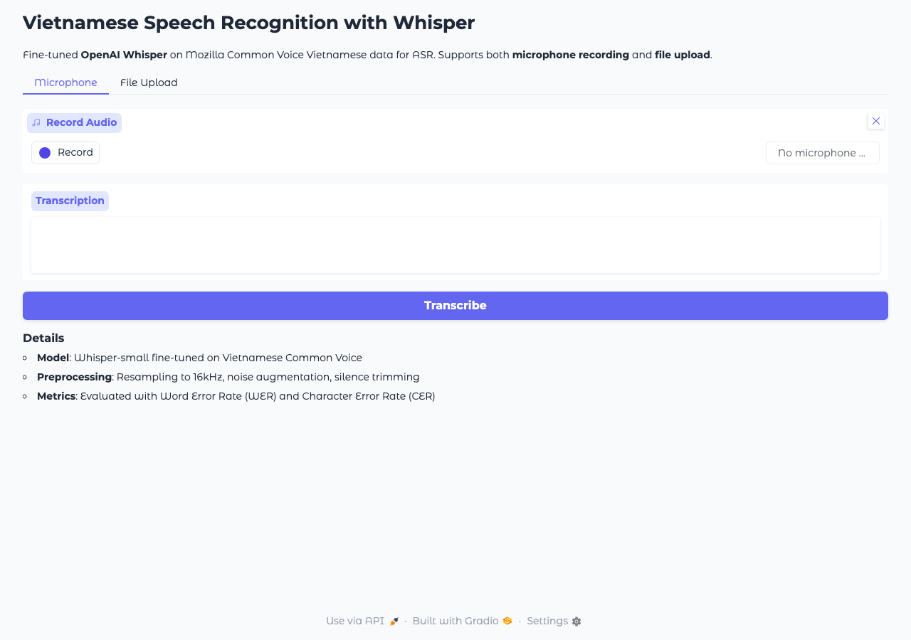

# Vietnamese Speech Recognition with Whisper

Fine-tuned **OpenAI's Whisper** on **Mozilla Common Voice Vietnamese** data for automatic speech recognition (ASR). Audio preprocessing with **Librosa** (resampling, noise augmentation, silence trimming). Evaluated with **WER/CER** metrics. Deployed as a **Gradio** demo with microphone and file input.

[](https://huggingface.co/spaces/sanvo/vietnamese-whisper-asr)

## Demo



**[Try the live demo on Hugging Face Spaces](https://huggingface.co/spaces/sanvo/vietnamese-whisper-asr)**

## Features

- Fine-tuned **Whisper-small** on Vietnamese Common Voice data
- Audio preprocessing pipeline with Librosa:
  - Resampling to 16kHz
  - Noise augmentation (configurable SNR)
  - Silence trimming
  - Peak normalization
- **WER/CER** evaluation with jiwer
- **Gradio demo** with microphone recording and file upload
- Configurable training via YAML

## Setup

```bash
git clone https://github.com/svn05/vietnamese-whisper-asr.git
cd vietnamese-whisper-asr
pip install -r requirements.txt
```

## Usage

### Train
```bash
# 1. Prepare data (downloads Common Voice Vietnamese)
python data/prepare_common_voice.py --max-samples 10000

# 2. Fine-tune Whisper
python train.py --epochs 5 --batch-size 8 --lr 1e-5

# 3. Evaluate
python evaluate.py
```

### Transcribe audio
```bash
python transcribe.py --audio path/to/audio.wav
```

### Preprocess audio
```bash
python preprocess.py --audio raw_audio.wav --output processed.wav --augment
```

### Run Gradio demo
```bash
python app.py
```

## Audio Preprocessing

```
Raw Audio → Resample (16kHz) → Silence Trim (25dB) → Noise Aug (10-30dB SNR)
    → Peak Normalize → Whisper Input Features (80-dim Mel Spectrogram)
```

## Project Structure

```
vietnamese-whisper-asr/
├── train.py                  # Fine-tune Whisper
├── transcribe.py             # Inference on audio files
├── evaluate.py               # WER/CER evaluation
├── preprocess.py             # Audio preprocessing (Librosa)
├── app.py                    # Gradio demo (mic + file upload)
├── data/
│   └── prepare_common_voice.py  # Dataset download + prep
├── configs/
│   └── config.yaml           # Hyperparameters
├── outputs/                  # Model checkpoints (generated)
├── requirements.txt
└── README.md
```

## Tech Stack

- **Whisper** (OpenAI) — Pre-trained speech recognition model
- **Librosa** — Audio loading, resampling, feature extraction
- **HuggingFace Transformers** — Model fine-tuning
- **jiwer** — WER/CER evaluation metrics
- **Gradio** — Interactive demo with mic/file input
- **Mozilla Common Voice** — Vietnamese speech training data
